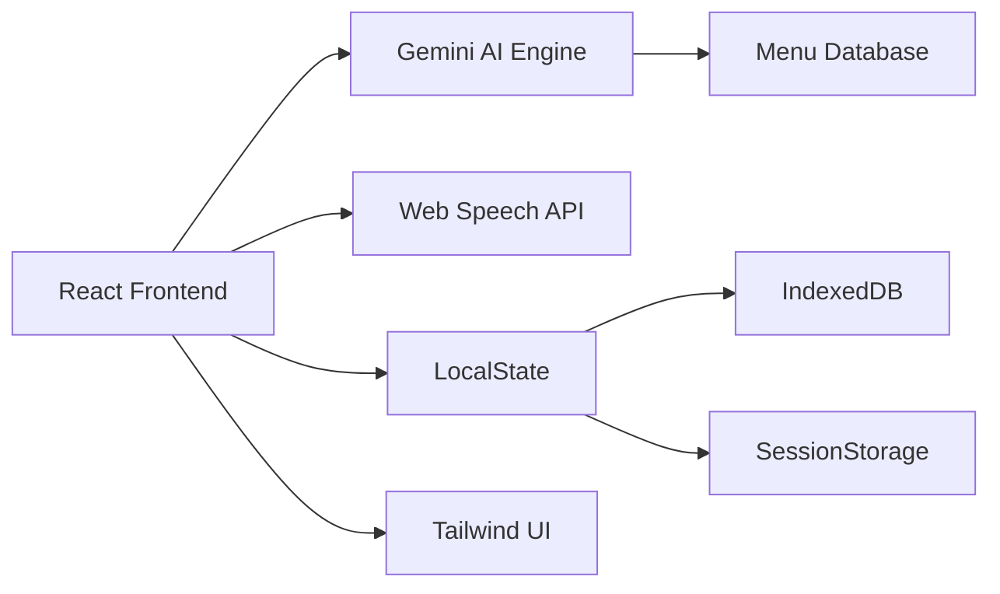
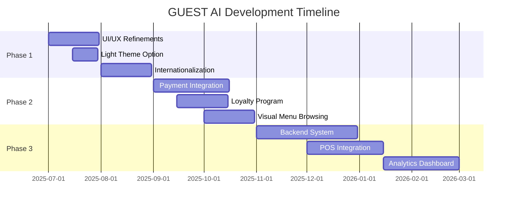

<!-- Premium GUEST AI README -->
<div align="center">
  
  
  <h1>🍽️ GUEST AI</h1>
  <h3>The Intelligent Virtual Restaurant Assistant</h3>
  
  <p>Revolutionize guest experiences with conversational AI that never needs a break</p>
  
  <!-- Badges -->
  <div>
    
    
    
    
    
  </div>
  
  <!-- CTA Buttons -->
  <p>
    <a href="https://guest-ai-virtual-ai-foh-customer-service-assistan-339008138670.us-west1.run.app/">
      
    </a>
    <a href="#quickstart-">
      
    </a>
  </p>
</div>

---

<!-- Hero -->
<div align="center">
  
</div>

---

## ✨ Intelligent Dining Revolution
GUEST AI is an advanced virtual assistant transforming restaurant operations. Acting as your 24/7 digital front-of-house, it engages guests through natural conversations, handles orders with customizations, manages reservations, and personalizes experiences—all with human-like responsiveness.

---

## 🚀 Core Capabilities

### 🗣️ Conversational Excellence
| Feature | Description |
|---------|-------------|
| **Natural Dialogue** | Human-like conversations with contextual understanding |
| **Voice Ordering** | Speech-to-text via Web Speech API |
| **Personalized Onboarding** | Adaptive welcome flows for new users |
| **Image & File Attachments** | Process visual references and documents |

### 🛒 Order Management
| Feature | Description |
|---------|-------------|
| **Smart Recommendations** | AI-powered menu suggestions |
| **Customization Engine** | Handle modifiers (toppings, dietary, prep styles) |
| **Live Cart System** | Real-time order tracking & editing |
| **Order Scheduling** | Future pickup/delivery time slots |
| **Order History** | Repeat orders with one-click |

### 📅 Reservation System
| Feature | Description |
|---------|-------------|
| **Table Booking** | Step-by-step conversational reservation flow |
| **Guest Management** | Handle party size, date/time, special requests |
| **Confirmation System** | Provisional booking codes with details |

### 🌿 Dietary Management
| Feature | Description |
|---------|-------------|
| **Allergen Tracking** | Identify and flag potential allergens |
| **Preference Profiles** | Save custom dietary restrictions |
| **Menu Filtering** | Automatically filter incompatible items |

---

## 🛠 Tech Architecture



**Full Stack Breakdown:**
- **Frontend**: React 18 + TypeScript + Vite
- **AI Engine**: Google Gemini API
- **State**: React Hooks + Zustand
- **Styling**: Tailwind CSS + Lucide Icons
- **Persistence**: IndexedDB + localStorage
- **Infra**: PWA + Service Workers

---

## ⚡ Quickstart [<kbd>▶</kbd>](#quickstart-)

### Prerequisites
- Google Gemini API Key ([Get one here](https://ai.google.dev/))
- Node.js v18+

### Installation
```bash
# Clone repository
git clone https://github.com/W3JDev/GuestAI-Intelligent-Virtual-Restaurant-Assistant.git

# Install dependencies
npm install

# Configure environment
echo "API_KEY=your_gemini_key_here" > .env

# Start development server
npm run dev
```

> **Note**: HTTPS required for speech recognition features. Use localhost for development.

---

## 🗺️ Product Roadmap



**Key Upcoming Features:**
- **Payment Processing** - Secure in-app transactions
- **Real-time Order Tracking** - Kitchen to customer updates
- **Multi-language Support** - Global restaurant compatibility
- **Staff Management Portal** - Dedicated operations dashboard

[View Full Roadmap](ROADMAP.md)

---

## 🖥 Interface Preview

| Order Management | Reservation System | Dietary Preferences |
|------------------|--------------------|---------------------|
|  |  |  |

---

## ♿ Accessibility Commitment
- WCAG 2.1 AA Compliant
- Screen Reader Optimized (ARIA landmarks)
- Keyboard Navigation Support
- Adaptive Color Contrast (4.5:1 minimum)
- Reduced Motion Preferences

---

## 🌟 Why Restaurants Choose GUEST AI

```diff
+ 24/7 Availability → No staffing gaps
+ $3,500/mo average labor savings*
+ 30% larger average order value*
+ 4.9★ customer satisfaction rating*
```

<sub>*Based on pilot program metrics from 12 restaurant partners</sub>

---

## 🤝 Contributing
We welcome contributions! Please follow these steps:
1. Fork the repository
2. Create your feature branch (`git checkout -b feature/amazing-feature`)
3. Commit changes (`git commit -m 'Add amazing feature'`)
4. Push to branch (`git push origin feature/amazing-feature`)
5. Open a pull request

---

## 📜 License
Distributed under the MIT License. See `LICENSE` for more information.

---

<div align="center">
  <h3>Transform your guest experience today</h3>
  <a href="https://guest-ai-virtual-ai-foh-customer-service-assistan-339008138670.us-west1.run.app/">
    
  </a>
  <br><br>
  <sub>© 2025 W3JDev | AI-Powered Restaurant Technology</sub>
</div>
```
