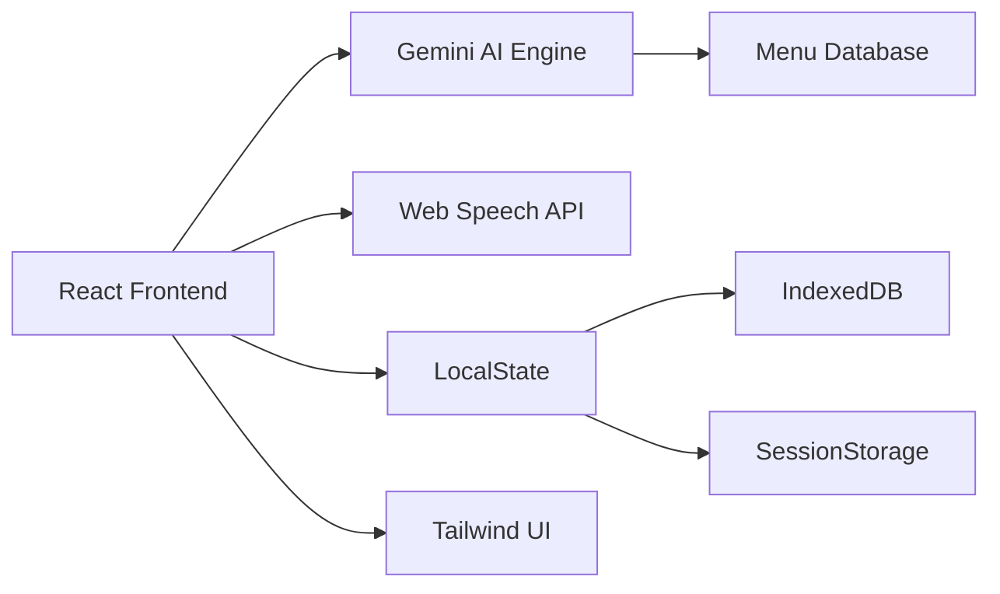
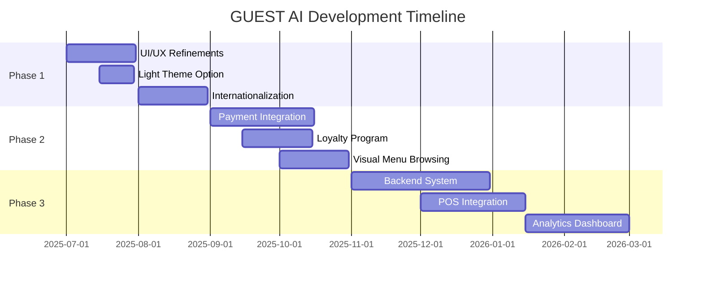

<div align="center">
  <!-- Header/Title Image Mockup -->
  

  <h1>🍽️ GUEST AI</h1>
  <h3>The Intelligent Virtual Restaurant Assistant</h3>

  <p>Revolutionize guest experiences with conversational AI that never needs a break</p>

  <!-- Badges -->
  <div>
    
    
    
    
    
    
    
    
  </div>

  <!-- CTA Buttons -->
  <p>
    <a href="https://guest-ai-virtual-ai-foh-customer-service-assistan-339008138670.us-west1.run.app/">
      
    </a>
    <a href="#quickstart-">
      
    </a>
  </p>
</div>

---

## 📋 Table of Contents
- [Intelligent Dining Revolution](#-intelligent-dining-revolution)
- [Customer Journey Map](#customer-journey-map)
- [Personalized Guest AI Experience](#personalized-guest-ai-experience)
- [Customer Success Spotlight](#-customer-success-spotlight)
- [Core Capabilities](#-core-capabilities)
- [✨ Guest AI Feature](#-guest-ai-feature)
- [Benefits of Guest AI](#-benefits-of-guest-ai)
- [Tech Architecture](#-tech-architecture)
- [Quickstart](#-quickstart-)
- [Product Roadmap](#-product-roadmap)
- [Accessibility Commitment](#-accessibility-commitment)
- [Why Restaurants Choose GUEST AI](#-why-restaurants-choose-guest-ai)
- [FAQ](#faq)
- [Contributing](#-contributing)
- [Community & Support](#community--support)
- [License](#-license)

---

## ✨ Intelligent Dining Revolution
GUEST AI is an advanced virtual assistant transforming restaurant operations. Acting as your 24/7 digital front-of-house, it engages guests through natural conversations, handles orders with customizations, manages reservations, and personalizes experiences—all with human-like responsiveness.

---

## Customer Journey Map

<div align="center">
  
</div>

---

## Personalized Guest AI Experience

<div align="center">
  
</div>

---

## 🌟 Customer Success Spotlight

<div align="center">
  
</div>

---

## 🚀 Core Capabilities

### 🗣️ Conversational Excellence
| Feature | Description |
|---------|-------------|
| **Natural Dialogue** | Human-like conversations with contextual understanding |
| **Voice Ordering** | Speech-to-text via Web Speech API |
| **Personalized Onboarding** | Adaptive welcome flows for new users |
| **Image & File Attachments** | Process visual references and documents |

### 🛒 Order Management
| Feature | Description |
|---------|-------------|
| **Smart Recommendations** | AI-powered menu suggestions |
| **Customization Engine** | Handle modifiers (toppings, dietary, prep styles) |
| **Live Cart System** | Real-time order tracking & editing |
| **Order Scheduling** | Future pickup/delivery time slots |
| **Order History** | Repeat orders with one-click |

### 📅 Reservation System
| Feature | Description |
|---------|-------------|
| **Table Booking** | Step-by-step conversational reservation flow |
| **Guest Management** | Handle party size, date/time, special requests |
| **Confirmation System** | Provisional booking codes with details |

### 🌿 Dietary Management
| Feature | Description |
|---------|-------------|
| **Allergen Tracking** | Identify and flag potential allergens |
| **Preference Profiles** | Save custom dietary restrictions |
| **Menu Filtering** | Automatically filter incompatible items |

---

## ✨ Guest AI Feature

<div align="center">
  
</div>

---

## 💡 Benefits of Guest AI

<div align="center">
  
</div>

---

## 🛠 Tech Architecture



**Full Stack Breakdown:**
- **Frontend**: React 18 + TypeScript + Vite
- **AI Engine**: Google Gemini API
- **State**: React Hooks + Zustand
- **Styling**: Tailwind CSS + Lucide Icons
- **Persistence**: IndexedDB + localStorage
- **Infra**: PWA + Service Workers

---

## ⚡ Quickstart [<kbd>▶</kbd>](#quickstart-)

### Prerequisites
- Google Gemini API Key ([Get one here](https://ai.google.dev/))
- Node.js v18+

### Installation
```bash
# Clone repository
git clone https://github.com/W3JDev/GuestAI-Intelligent-Virtual-Restaurant-Assistant.git

# Install dependencies
npm install

# Configure environment
echo "API_KEY=your_gemini_key_here" > .env

# Start development server
npm run dev
```

> **Note**: HTTPS required for speech recognition features. Use localhost for development.

---

## 🗺️ Product Roadmap



**Key Upcoming Features:**
- **Payment Processing** - Secure in-app transactions
- **Real-time Order Tracking** - Kitchen to customer updates
- **Multi-language Support** - Global restaurant compatibility
- **Staff Management Portal** - Dedicated operations dashboard

[View Full Roadmap](ROADMAP.md)

---

## ♿ Accessibility Commitment
- WCAG 2.1 AA Compliant
- Screen Reader Optimized (ARIA landmarks)
- Keyboard Navigation Support
- Adaptive Color Contrast (4.5:1 minimum)
- Reduced Motion Preferences

---

## 🌟 Why Restaurants Choose GUEST AI

```diff
+ 24/7 Availability → No staffing gaps
+ $3,500/mo average labor savings*
+ 30% larger average order value*
+ 4.9★ customer satisfaction rating*
```
<sub>*Based on pilot program metrics from 12 restaurant partners</sub>

---

## FAQ

**Q: Can GUEST AI integrate with my existing POS system?**  
A: POS integration is on the roadmap! See [Product Roadmap](#-product-roadmap) for details.

**Q: Is my customer data secure?**  
A: Yes, privacy and security are core priorities. All data is handled in accordance with industry best practices.

**Q: Does it support multiple languages?**  
A: Multi-language support is in active development.

**Q: How do I get help or support?**  
A: [Join our community](#community--support) or open an issue on GitHub.

---

## 🤝 Contributing

We welcome contributions of all kinds!

### How to contribute
1. **Fork** the repository
2. **Clone** your fork: `git clone https://github.com/your-username/GuestAi.git`
3. **Create a branch**: `git checkout -b feature/my-feature`
4. **Commit your changes**: `git commit -m 'Add my feature'`
5. **Push to GitHub**: `git push origin feature/my-feature`
6. **Open a Pull Request** describing your changes

### Guidelines
- Follow the code style used in the project
- Include tests when adding features
- Document your code and changes

For more, see [CONTRIBUTING.md](CONTRIBUTING.md).

---

## Community & Support

- **GitHub Discussions:** [Ask a question](https://github.com/W3JDev/GuestAi/discussions)
- **Issues:** [Report a bug](https://github.com/W3JDev/GuestAi/issues)
- **Email:** [w3jdev@example.com](mailto:w3jdev@example.com)
- *(Discord/Slack/community link placeholder)*

---

## 📜 License
Distributed under the MIT License. See `LICENSE` for more information.
---

 <div align="center">
  
</div>

---

<div align="center">
  <h3>Transform your guest experience today</h3>
  <a href="https://guest-ai-virtual-ai-foh-customer-service-assistan-339008138670.us-west1.run.app/">
    
  </a>
  <br><br>
  <sub>© 2025 W3JDev | AI-Powered Restaurant Technology</sub>
</div>
```

---
